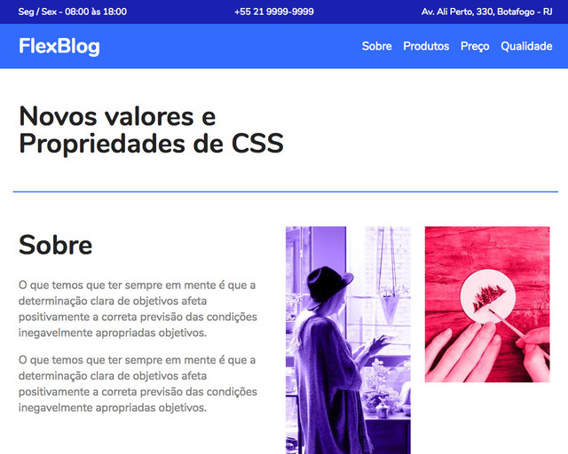

# FlexBlog #

## Réplica do site feito no curso de Flexbox da [Origamid](www.origamid.com). ##

### O objetivo foi usar das principais funcionalidades do Flex de forma simples, comparando com as 'tricks' (gambiarras) que eram usadas antes da ferramenta surgir. Um exemplo é o uso exagerado do float e muitas divs, muito reduzido com o flex. ### 

**Feito em 2021**

----------

----------
